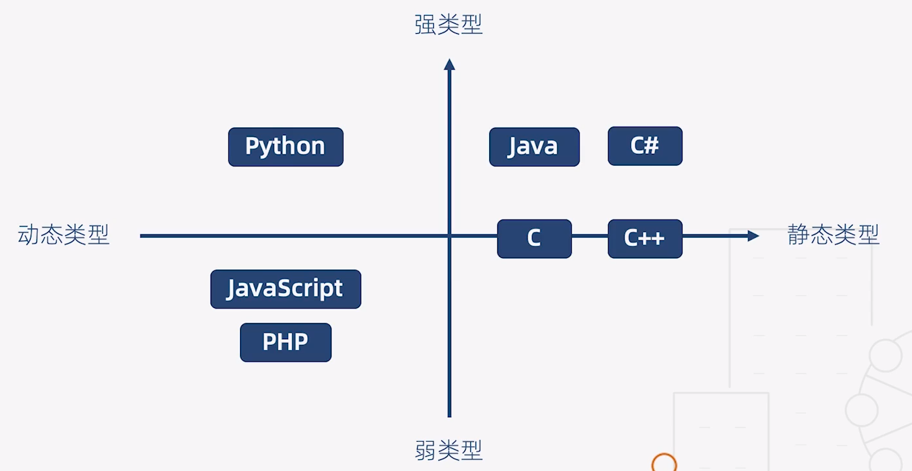
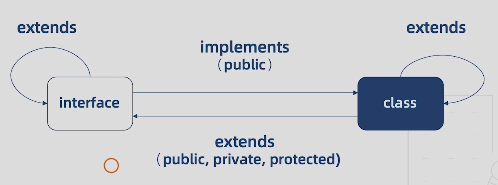

##  基础篇

### 一、类型基础

#### 1 强类型语言与弱类型语言

+ 强类型语言：不允许改变变量的数据类型，除非进行强制类型转换（不允许程序在发生错误后继续执行）
+ 弱类型语言：变量可以被赋予不同的数据类型

####  2 静态类型语言与动态类型语言

+ 静态类型语言：在编译阶段确定所有变量的类型
+ 动态类型语言：在执行阶段确定所有变量的类型

| 静态类型语言   | 动态类型语言            |
| -------------- | ----------------------- |
| 对类型极度严格 | 对类型非常宽松          |
| 立即发现错误   | Bug可能隐藏数月甚至数年 |
| 运行时性能好   | 运行时性能差            |
| 自文档化       | 可读性差                |

> 动态类型语言的支持者认为：
>
> + 性能是可以改善的（V8引擎），而语言的灵活性更重要
> + 隐藏的错误可以通过单元测试发现
> + 文档可以通过工具生成




###  二、基本类型

| ES6的数据类型             | TypeScript的数据类型    |
| ----------------------- | ----------------------- |
| Boolean(基本数据类型)     | Boolean(基本数据类型)   |
| Number(基本数据类型)      | Number(基本数据类型)    |
| String(基本数据类型)      | String(基本数据类型)    |
| Symbol(基本数据类型)      | Symbol(基本数据类型)    |
| undefined(基本数据类型)   | undefined(基本数据类型) |
| null(基本数据类型)        | null(基本数据类型)      |
| Array(引用数据类型)       | Array(引用数据类型)     |
| Function(引用数据类型)    | Function(引用数据类型)  |
| Object(引用数据类型)      | Object(引用数据类型)    |
|                         | void(基本数据类型)      |
|                         | any(基本数据类型)       |
|                         | never(基本数据类型)     |
|                         | 元组(基本数据类型)       |
|                         | 枚举                   |
|                         | 高级类型                |

#### 1 类型注解

+ 作用：相当于强类型语言中的类型声明
+ 语法：（变量 / 函数）: type

#### 2 枚举

+ 含义：一组有名字的常量集合


### 三、接口

####  1、对象类型接口

```typescript
interface List {
  readonly id: number; // 加readonly表示只读属性
  name: string;
  // [x: string]: any; // 字符串索引签名（索引签名可绕过类型检查）
  age?: number; // 加?表示可选属性
}
```

> #####  绕过类型检查的三种方式

```typescript
interface Result {
  data: List[]
}

function render(result: Result) {
  result.data.forEach((value) => {
    console.log(value.id, value.name)
  })
}

// 1.变量赋值
let result = {
  data: [
    {id: 1, name: 'A'},
    {id: 2, name: 'B', age: 10}
  ]
}
render(result)

// 2.类型断言：避免乱用
// 方式一： 推荐方式
render({
  data: [
    {id: 1, name: 'A', sex: 'male'},
    {id: 2, name: 'B'}
  ]
} as Result)

// 方式二： 在React中会产生歧义
render(<Result>{
  data: [
    {id: 1, name: 'A', sex: 'male'},
    {id: 2, name: 'B'}
  ]
})

// 绕过类型检查三：索引签名
interface List {
  id: number;
  name: string;
  [x: string]: any; // 字符串索引
}
```


####  2、函数类型接口

```typescript
// 变量
let add1: (x: number, y: number) => number

// 接口
interface Add {
   (x: number, y: number): number
}

// 类型别名
type Add1 = (x: number, y: number) => number
```


####  3、函数总结

```typescript
// 函数定义
// 常规函数定义
function add1(x: number, y: number) {
  return x + y
}

// 变量
let add2: (x: number, y: number) => number

// 类型别名
type add3 = (x: number, y: number) => number

// 接口
interface add4 {
  (x: number, y: number): number
}

// 可选参数必须位于必选参数之后
function add5(x: number, y?: number) {
  return y ? x + y : x
}

function add6(x: number, y = 0, z: number, q = 1) {
  return x + y + z + q
}
// 必选参数之后的默认参数可不传
console.log(add6(1, undefined, 3));

function add7(x : number, ...rest: number[]) {
  return x + rest.reduce((pre, cur) => pre + cur)
}
console.log(add7(1, 2, 3, 4, 5))

// 函数重载
function add8(...rest: number[]): number;
function add8(...rest: string[]): string;
function add8(...rest: any[]): any {
  let first = rest[0];
  if (typeof first === 'string') {
    return rest.join('')
  }
  if (typeof first === 'number') {
    return rest.reduce((pre, cur) => pre + cur)
  }
}

console.log(add8(1, 2, 3))
console.log(add8('a', 'b', 'c'))
```


###  四、类

####  1、 继承和成员修饰符

```typescript
/**
 * public: 公有成员
 * private: 私有成员
 */
class Dog {
  // 在构造函数声明私有成员，该类将不可被实例化，也不可被继承
  // private constructor(name: string) {
  constructor(name: string) {
    this.name = name
  }
  // 默认是public，也可以写出来
  public name: string
  run() {}
  // 声明私有成员之后，既不能被实例调用，也不能子类继承或者调用
  private pri() {}
  // 声明受保护成员之后，不能在实例中访问，但可以在子类中访问
  protected pro() {}
  readonly legs: number = 4
  // 静态成员：类的静态成员只能通过类名来调用,不能通过实例来调用
  static food: string = 'bones'
}

console.log(Dog.prototype);
let dog = new Dog('wang')
console.log(dog)
// dog.pri() // 报错：属性‘pri’为私有属性，只能在类‘Dog’中访问
// dog.pro() //  报错：属性‘pro’为私有属性，只能在类‘Dog’及其子类中访问
console.log(Dog.food);

class Husky extends Dog {
  constructor(name: string, public color: string) {
    super(name)
    this.color = color
    // this.pri() // 报错：属性‘pri’为私有属性，只能在类‘Dog’中访问
    this.pro()
  }
  // color: string
}
console.log(Husky.food);
```


#### 2、 抽象类与多态

```typescript
// 抽象类:只能被继承，不能被实例化的类
abstract class Animal {
  eat() {
    console.log('eat')
  }
  // 抽象方法：不定义方法的具体实现
  abstract sleep(): void
}

// let animal = new Animal() // 报错：无法创建抽象类的实例

class Cat extends Animal {
  constructor(name: string) {
    super()
    this.name = name
  }
  name: string
  run() {}
  sleep() {
    console.log('cat sleep')
  }
}
let cat = new Cat('cafee')
cat.eat()

// 多态
class Lion extends Animal {
  sleep() {
    console.log('Lion sleep');
  }
}
let lion = new Lion();

let animals: Animal[] = [cat, lion]
animals.forEach(i => {
  i.sleep()
})

class WorkFlow {
  step1() {
    return this
  }
  step2() {
    return this
  }
}
new WorkFlow().step1().step2()

class MyFlow extends WorkFlow {
  next() {
    return this
  }
}
new MyFlow().next().step1().step2()
```


####  3、类与接口的关系

> + 接口之间可以相互继承，实现接口的复用
> + 类之间也可以相互继承，实现类的方法和属性的复用
> + 接口可以通过类实现，但接口只能约束类的公有成员，不能约束类的构造函数
> + 接口可以抽离出类的成员，包括公有成员、私有成员和受保护成员
> + 类实现接口时，必须实现接口中所有的属性



```typescript
/**
 * 类与接口的关系：
 * 1. 类实现接口时，必须实现接口中所有的属性
 * 2. 接口只能约束类的公有成员
 * 3. 接口也不能约束类的构造函数
 */
interface Human {
  // 报错：类"Asian"错误实现接口"Human"（类型“Asian”提供的内容与签名“new (name: string): void”不匹配）
  // new (name: string): void;
  name: string;
  eat(): void;
}

class Asian implements Human {
  constructor(name: string) {
    this.name = name;
  }
  // 报错：类"Asian"错误实现接口"Human"（属性“name”在类型“Asian”中是私有属性，但在类型“Human”中不是）
  // private name: string
  name: string
  eat() {}
}

interface Man extends Human {
  run(): void
}

interface Child {
  cry(): void
}

interface Boy extends Man, Child {}

let boy: Boy = {
  name: '',
  run() {},
  eat() {},
  cry() {}
}

class Auto {
  state = 1
  // private state2 = 2
}

interface AutoInterface extends Auto {

}

class C implements AutoInterface {
  state = 1
}

class Bus extends Auto implements AutoInterface {
  
}
```


###  五、泛型

>  含义

​	不预先确定的数据类型，具体的类型在使用的时候才能确定。

> 好处

+ 函数和类可以轻松地支持多种类型，增强程序的扩展性

+ 不必写多条函数重载，冗长的联合类型 声明，增强代码的可读性

+ 灵活控制类型之间的约束

#### 1、泛型函数与泛型接口

```typescript
// 泛型函数
function log<T>(value: T): T {
  console.log(value)
  return value
}

// 泛型接口
interface Log<T = string> {
  (value: T): T
}
let myLog: Log = log
myLog('1')
```


####  2、泛型类与泛型约束

```typescript
// 泛型类
class Logger<T> {
  // 静态成员不能引用类类型参数
  // static run(value: T) {
  run(value: T) {
    console.log(value)
    return value
  }
}

// 泛型约束
interface Length {
  length: number
}

// 泛型函数
function logger<T extends Length>(value: T): T {
  console.log(value, value.length)
  return value
}
```


### 六、类型检查机制

> 含义

​	TypeScript编译器在做类型检查时，所秉承的一些原则，以及表现出的一些行为。

> 作用

​	 辅助开发，提高开发效率。

> 组成

+ 类型推断
+ 类型兼容性
+ 类型保护


####  1、类型推断

> 组成

+ 类型推断
+ 最佳通用类型推断
+ 上下文类型推断

```typescript
let a = 1 // => 类型推断为number
let a1 = [1, null] // => 类型推断为number | null
```

> 注意：避免乱用类型断言，有时候会遗漏属性的赋值等操作

```typescript
interface Foo {
  bar: Number
}
// 类型断言
let foo = {} as Foo
// foo.bar = 1 // 避免乱用类型断言,容易出现属性的遗漏赋值

// 推荐使用常规的声明方式
let foo: Foo = {
  bar: 1
}
```


####  2、类型兼容性

> 含义

​	当一个类型Y可以被赋值给另一个类型X时，我们就可以说类型X兼容类型Y 

​	X兼容Y: X(目标类型) = Y(源类型)

> 理解

​	源类型必须具备目标类型的必要属性，就可以进行赋值。

#####  2.1、接口兼容性

```typescript
// 接口兼容性：成员少的会兼容成员多的
interface X {
  a: any;
  b: any;
}

interface Y {
  a: any;
  b: any;
  c: any;
}

let x1: X = {a: 1, b: 2}
let y1: Y = {a: 1, b: 2, c: 1}
// y1可以被赋值给x1
x1 = y1
// y = x1 // 报错：类型 "X" 中缺少属性 "c"，但类型 "Y" 中需要该属性。
```


##### 2.2、函数兼容性

```typescript
// 函数兼容性：参数多的会兼容参数少的
type Handler = (a: number, b: number) => void
function hof(handler: Handler) {
  return handler
}

// 高阶函数兼容性问题考虑要素：
// 1)参数个数
let handler1 = (a: number) => {}
hof(handler1)
let handler2 = (a: number, b: number, c:number) => {}
// hof(handler2) // 报错：类型“(a: number, b: number, c: number) => void”的参数不能赋给类型“Handler”的参数。

// 可选参数和剩余参数
// 参数多的可以兼容少的
// 固定参数  兼容    可选参数 剩余参数
// 可选参数  不兼容  固定参数 剩余参数
// 剩余参数  兼容    固定参数 可选参数
let a5 = (p1: number, p2:number) => {}
let b5 = (p1?: number, p2?:number) => {}
let c5 = (...args: number[]) => {}
a5 = b5 // 固定参数 兼容 可选参数
a5 = c5 // 固定参数 兼容 剩余参数
// b5 = c5 // 报错：可选参数 不兼容 剩余参数
// b5 = a5 // 报错：可选参数 不兼容 固定参数
c5 = a5 // 剩余参数 兼容   固定参数
c5 = b5 // 剩余参数 兼容   可选参数

// 2) 参数类型
let handler3 = (a: string) => {}
// hof(handler3) // 报错类型“(a: string) => void”的参数不能赋给类型“Handler”的参数。

interface Point3D {
  x: number;
  y: number;
  z: number
}

interface Point2D {
  x: number;
  y: number;
}

let p3d = (point: Point3D) => {}
let p2d = (point: Point2D) => {}
p3d = p2d // 成员个数多的能兼容成员个数少的
// p2d = p3d // 报错：不能将类型“(point: Point3D) => void”分配给类型“(point: Point2D) => void”。在tsconfig.json中修改“strictFunctionTypes: false”，则能去除兼容错误。
// 这种函数的相互赋值方式称之为函数的双向协定。这种情况允许我们将精确的类型赋值给不那么精确的类型，这样我们就不需要把不精确的类型断言成精确的类型。

// 3)返回值类型
let a8 = () => ({name: 'Alice'})
let a9 = () => ({name: 'Alice', location: '广州'})
a8 = a9
// a9 = a8 // 报错：不能将类型“() => { name: string; }”分配给类型“() => { name: string; location: string; }”。

// 函数重载兼容性
function overload(a: number, b: number): number;
function overload(a: string, b: string): string;
function overload(a: any, b: any): any {};
```


##### 2.3、枚举类型兼容性

```typescript
enum Fruit { Apple, Banana }
enum Color { Red, Yellow }
let fruit: Fruit.Apple = 3
let no: number = Fruit.Apple
// let color: Color.Red = Fruit.Apple // 报错：不能将类型“Fruit.Apple”分配给类型“Color.Red”。
```


##### 2.4、类兼容性

```typescript
class A {
  constructor(p: number, q: number) {}
  id: number = 1
  private name: string = ''
}

class B {
  static s = 1
  constructor(p: number) {}
  id: number = 2
  private name: string = ''
}
let aa = new A(1, 2)
let bb = new B(1)
// 如果类中有私有成员，则不能相互兼容
// aa = bb // 报错： 不能将类型“B”分配给类型“A”。
// bb = aa // 报错： 不能将类型“A”分配给类型“B”。
class D extends A {}
let dd = new D(1, 2)
aa = dd
dd = aa
```


##### 2.5、泛型兼容性

```typescript
// 泛型接口
interface Empty<T> {
  value: T
}
// let obj1: Empty<number> = {}
// let obj2: Empty<string> = {}
// 类型参数T被接口成员使用时，才会影响泛型接口的兼容性
// obj1 = obj2 // 报错：类型 "{}" 中缺少属性 "value"，但类型 "Empty<number>" 中需要该属性。
// obj2 = obj1 // 报错：类型 "{}" 中缺少属性 "value"，但类型 "Empty<string>" 中需要该属性。

// 泛型函数
let log1 = <T>(x: T): T => {
  console.log('x')
  return x
}
let log2 = <T>(y: T): T => {
  console.log('y')
  return y
}
// 如果泛型的定义相同，但是没有指定类型参数，那么他们之间也是可以相互兼容的
log1 = log2
log2 = log1
```


> 总结

+ 接口之间兼容：成员少的兼容成员多的
+ 函数之间兼容：参数多的兼容参数少的


####  3、类型保护

> 含义

​	TypeScript能够在特定的区块中保证变量属于某种确定的类型。

​	可以在此区块中放心地引用此类型的属性，或者调用此类型的方法。

```typescript
enum Type { Strong, Week }

class Java {
  helloJava() {
    console.log('Hello Java')
  }
  java: any
}

class JavaScript {
  helloJavaScript() {
    console.log('Hello JavaScript')
  }
  javascript: any
}

function getLanguage(type: Type, x: number | string) {
  let lang = type === Type.Strong ? new Java() : new JavaScript()
  // 类型保护机制：可以用类型断言的方式，不推荐，太麻烦
  if ((lang as Java).helloJava) {
    (lang as Java).helloJava()
  } else {
    (lang as JavaScript).helloJavaScript()
  }
  return lang
}
```


> 方法

+ instanceof
+ in
+ typeof
+ （保护）函数

```typescript
// 保护函数
function isJava(lang: Java | JavaScript): lang is Java {
  // 这种返回值叫类型隐私
  return (lang as Java).helloJava !== undefined
}

function getLanguage(type: Type, x: number | string) {
  let lang = type === Type.Strong ? new Java() : new JavaScript()
  // if ((lang as Java).helloJava) {
  //   (lang as Java).helloJava()
  // } else {
  //   (lang as JavaScript).helloJavaScript()
  // }

  // 1. instanceof
  // if (lang instanceof Java) {
  //   lang.helloJava()
  // } else {
  //   lang.helloJavaScript()
  // }

  // 2. in
  // if ('java' in lang){
  //   lang.helloJava()
  // } else {
  //   lang.helloJavaScript()
  // }

  // 3. typeof
  // if (typeof x === 'string') {
  //   x.length
  // } else {
  //   x.toFixed(2)
  // }

  // 4. 保护函数
  // if (isJava(lang)) {
  //   lang.helloJava()
  // } else {
  //   lang.helloJavaScript()
  // }
  return lang
}
```
> 总结
学习了TS的几种类型保护检查机制：
+ 类型推断
+ 类型兼容性
+ 类型保护
利用这些机制，配合IDEA的自动补全和提示功能，能够极大地提高我们的开发效率。


###  七、高级类型

```typescript
interface DogInterface {
  run(): void
}

interface CatInterface {
  jump(): void
}
```


####  1、交叉类型
  比较适合做对象的混用
```typescript
// 交叉类型
let pet: DogInterface & CatInterface = {
  run() {},
  jump() {}
}
```


####  2、联合类型
  可以使类型具备不确定性，增加代码的灵活性。
```typescript
// 1. 变量的联合类型
let aaa: number | string = 'a'
let bbb: 'a' | 'b' | 'c'
let ccc: 1 | 2 | 3

// 2. 对象的联合类型
class Dog1 implements DogInterface {
  run() {}
  eat() {}
}

class Cat1 implements CatInterface {
  jump() {}
  eat() {}
}

enum Master { Boy, Girl }
function getPet(master: Master) {
  let pet = master === Master.Boy ? new Dog1() : new Cat1()
  // 对象的联合类型: 取对象的交集
  pet.eat()
  // pet.run() // 报错：类型“Dog1 | Cat1”上不存在属性“run”。 类型“Cat1”上不存在属性“run”。
  return pet
}

interface Square {
  kind: 'square';
  size: number;
}

interface Rectangle {
  kind: 'rectangle';
  width: number;
  height: number;
}

interface Circle {
  kind: 'circle';
  r: number;
}

// 3. 接口的联合类型
type Shape = Square | Rectangle | Circle

function area(s: Shape) {
  switch(s.kind) {
    case 'square':
      return s.size * s.size
    case 'rectangle':
      return s.width * s.height
    case 'circle':
      return Math.PI * s.r ** 2
    default:
      return ((e: never) => {throw new Error(e)})(s)
  }
}
console.log(area({kind: 'circle', r: 1}));
```


####  3、索引类型

```typescript
let obj1 = {
  a: 1,
  b: 2,
  c: 3
}
function getValues(obj: any, keys: string[]) {
  return keys.map(key => obj[key])
}
console.log(getValues(obj1, ['a', 'b']));
```

> 三大基本概念

+ 查询操作符：keyof T
+ 索引访问操作符： T[K]
+ 泛型约束：T extends U

```typescript
/**
 * 索引类型
 *  索引类型可以实现对对象属性的查询和访问，然后再配合泛型约束，就能
 *  告诉我们建立对象、对象属性以及属性值之间的约束关系。
 */
 let obj1 = {
  a: 1,
  b: 2,
  c: 3
}
// function getValues(obj: any, keys: string[]) {
//   return keys.map(key => obj[key])
// }
// 函数优化：
function getValues<T, K extends keyof T>(obj: T, keys: K[]): T[K][] {
  return keys.map(key => obj[key])
}
console.log(getValues(obj1, ['a', 'b']));
// console.log(getValues(obj1, ['e', 'f'])); // 报错：不能将类型“"e"”分配给类型“"a" | "b" | "c"”。不能将类型“"f"”分配给类型“"a" | "b" | "c"”。

// 索引类型的三大基本概念：
// 1、查询操作符：keyof T
interface Obj {
  a: number,
  b: string
}
let key: keyof Obj

// 2、索引访问操作符： T[K]
let value: Obj['a']

// 3、泛型约束：T extends U
```


####  4、映射类型

```typescript
/** 
 * 映射类型
 * 含义：可以从一个旧的类型生成一个新的类型，比如把一个类型中的所有属性变成只读
 * 本质上是一种预先定义的泛型接口，通常还会结合索引类型去获取对象的属性和属性值，
 * 从而将一个对象映射成我们想要的结构。
 * */ 

interface Obj1 {
  a: string;
  b: number;
  c: boolean;
}

// 同态: 只会作用于旧类型的属性，而不会引入新的属性
// 1. Readonly<T> 将旧类型中的每一个成员都变成只读
type ReadonlyObj = Readonly<Obj1>
/*
type Readonly<T> = {
  readonly [P in keyof T]: T[P];
};
*/

// 2. Partial<T>  把旧类型中的每一个成员都变成可选的
type PartialObj = Partial<Obj1>
/*
type Partial<T> = {
  [P in keyof T]?: T[P];
};
*/

// 3. 接受两个参数：第一个是要抽取的对象，第二个是要抽取的属性的key
type PickObj = Pick<Obj1, 'a' | 'c'>
/*
type Pick<T, K extends keyof T> = {
  [P in K]: T[P];
};
*/

// 非同态：会创建一些新的属性
type RecordObj = Record<'x' | 'y', 1>;
/*
type Record<K extends keyof any, T> = {
  [P in K]: T;
};
*/
```


####  5、条件类型
  条件类型使类型具有了不唯一性，同样地，也增加了语言的灵活性。
> T extends U ? X : Y

```typescript
type TypeName<T> =
  T extends string ? 'string' :
  T extends number ? 'number' :
  T extends boolean ? 'boolean' :
  T extends undefined ? 'undefined' :
  T extends Function ? 'function' :
  'object'

type T1 = TypeName<string>
type T2 = TypeName<string[]>

// (A | B) extends U ? X : Y  等价于
// (A extends U ? X : Y) | (B extends U ? X : Y)

type T3 = TypeName<string | string[]>

type Diff<T, U> = T extends U ? never : T

type T4 = Diff<'a' | 'b' | 'c', 'a' | 'e'>
// 等价于 type T4 = Exclude<'a' | 'b' | 'c', 'a' | 'e'>
// Diff<'a' | 'b' | 'c', 'a' | 'e'>
// 等价于 Diff<'a', 'a' | 'e'> | Diff<'b', 'a' | 'e'> | Diff<'c', 'a' | 'e'>
// never | 'b' | 'c'
// 'b' | 'c'

type NotNull<T> = Diff<T, undefined | null>
type T5 = NotNull<string | number | undefined | null>
// 等价于 type T5 = NonNullable<string | number | undefined | null>

// 官方提供的内置方法
// Exclude<T, U> 从类型T过滤掉可以赋值给类型U的类型
// NonNullable<T>
// Extract<T, U> // 与Exclude相反，从类型T抽取出可以赋值给类型U的类型
type T6 = Extract<'a' | 'b' | 'c', 'a' | 'e'>

// ReturnType<T>
type T7 = ReturnType<() => string>
```

